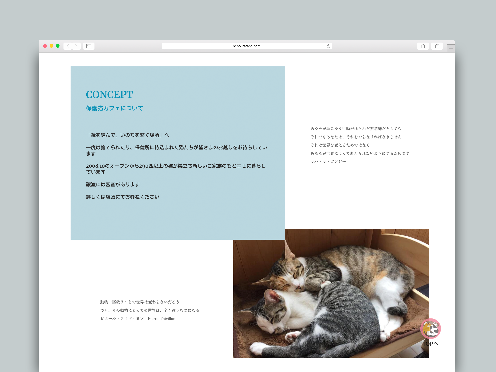
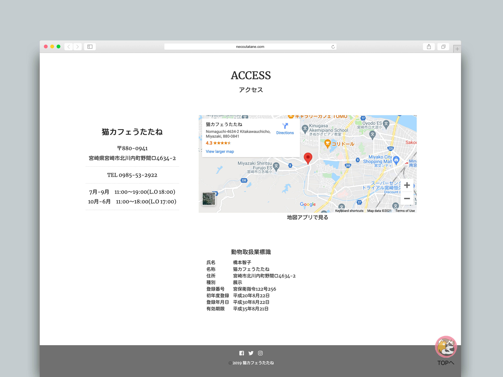

|          |                                                      |
| -------- | ---------------------------------------------------- |
| **Year** | 2019                                                 |
| **Role** | Web Derector                                         |
|          | Web Design                                           |
|          | WordPress build                                      |
| **Link** | [https://necoutatane.com/](https://necoutatane.com/) |

### Projects

**Cat Cafe Utatane** is a Japanese cat cafe which foster abundond cats, customers can spend time with those cats and they find parmanent homes for more than 300 cats. They had a website but it was already outdated, didn't have pages for mobile devices, so the owner wated to revamp it.

#### Concept

#### Access

