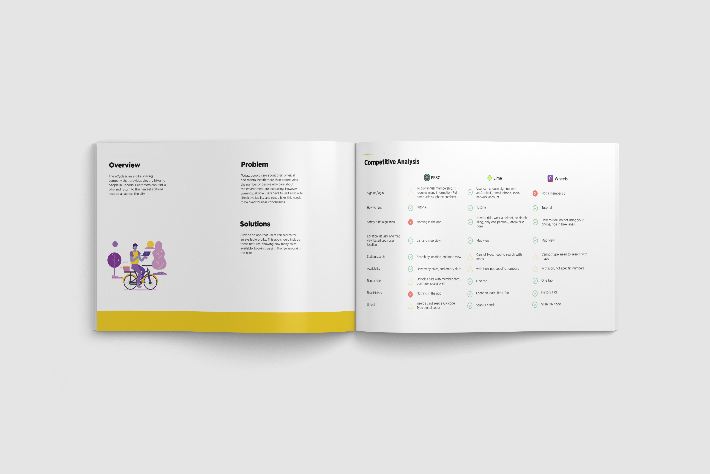
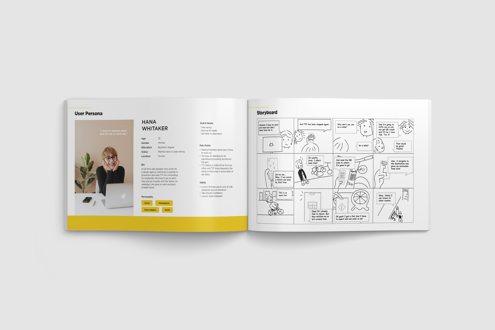
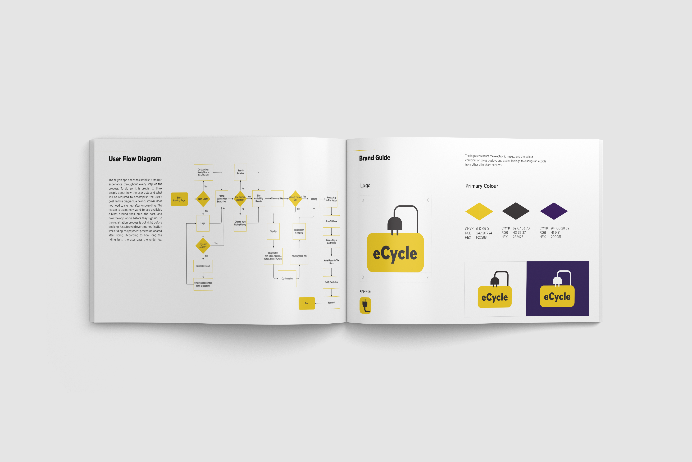
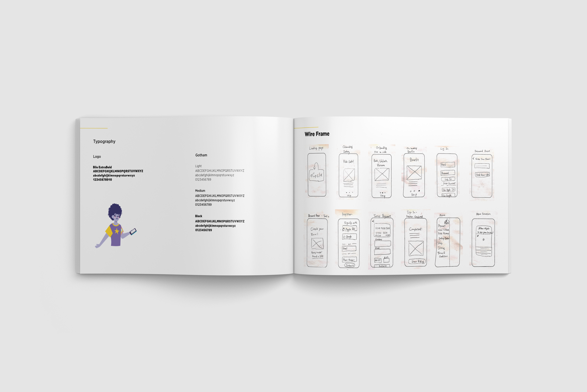
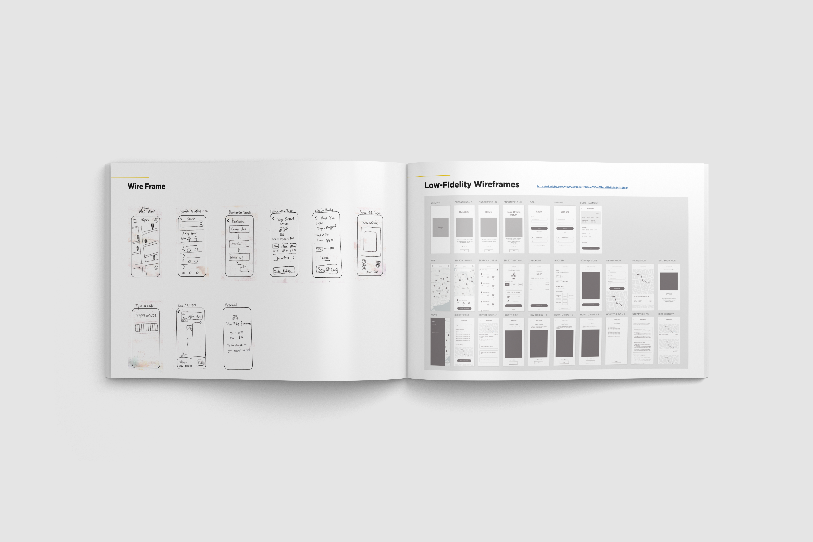

**The eCycle** is an e-bike sharing company that provides electric bikes to people in Canada. Customers can rent a bike and return to the nearest stations located all across the city.

## Problem

Today, people care about their physical and mental health more than before. Also, the number of people who care about the environment are increasing. However, currently, eCycle users have to visit a kiosk to check availability and rent a bike; this needs to be fixed for user convenience.

## Solution

Provide an app that users can search for an available e-bike. This app should include those features: showing how many bikes available, booking, paying the fee, unlocking the bike.

#### Overview & Competitive Analysis

#### Persona & Story Board

#### User Flow & Brand Guide

#### Brand Guide & Wire Frame

#### Wire Frame

## Prototype

`youtube: https://youtu.be/ueHnEm3CQrY`
