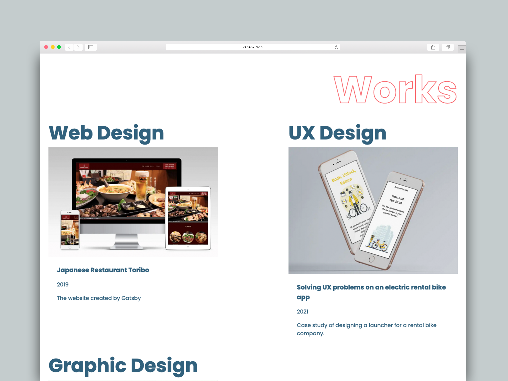
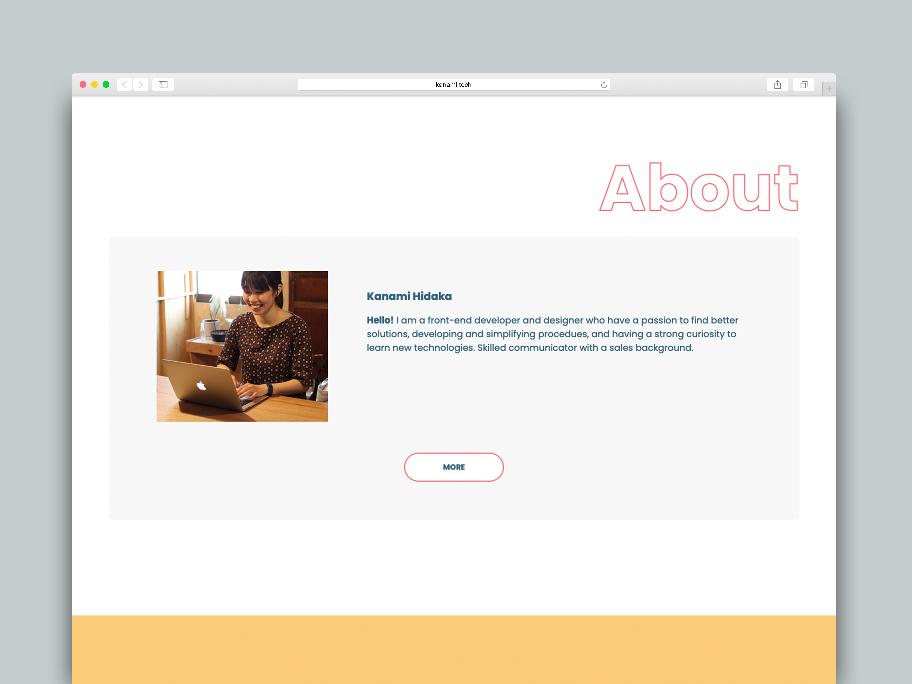
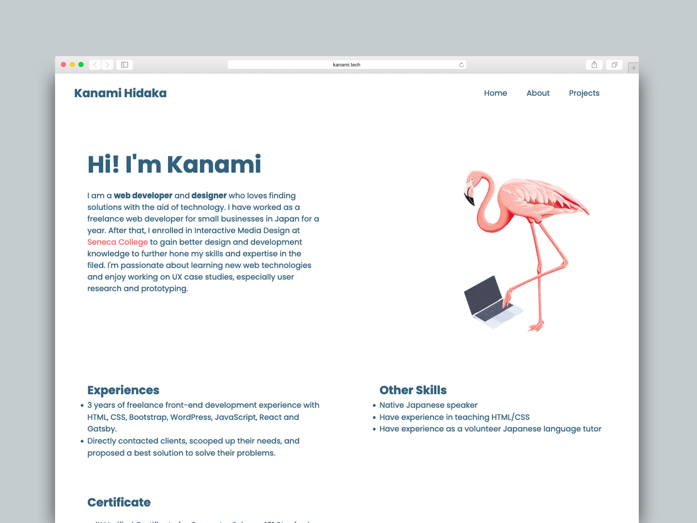
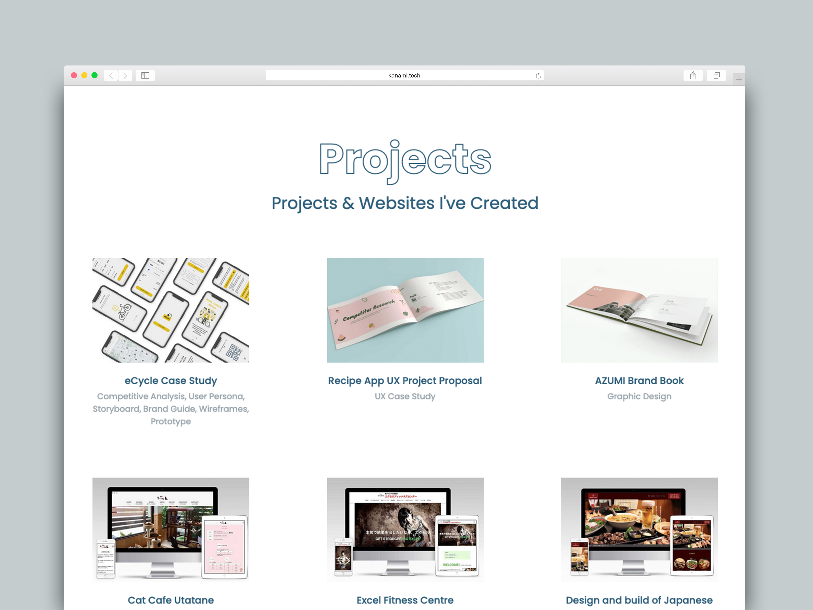
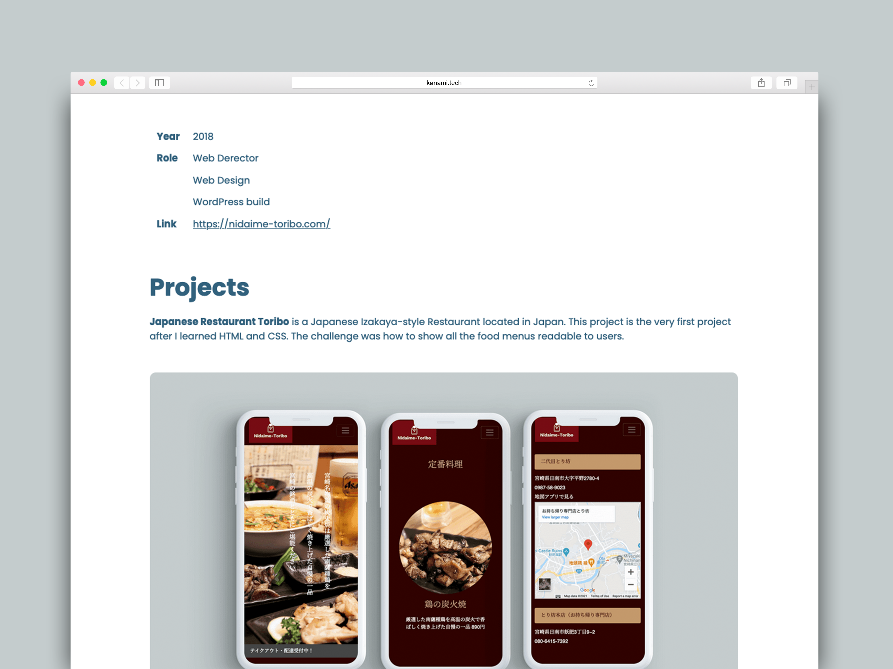

|          |                                            |
| -------- | ------------------------------------------ |
| **Year** | 2021                                       |
| **Role** | Web Derector                               |
|          | Web Design                                 |
|          | Front & back-end build                     |
| **Link** | [https://kanami.tech](https://kanami.tech) |

Built with Gatsby, GraphQL and hosted with Netlify.

#### Works

#### About

#### About Me

#### Project Page

#### Project Details

